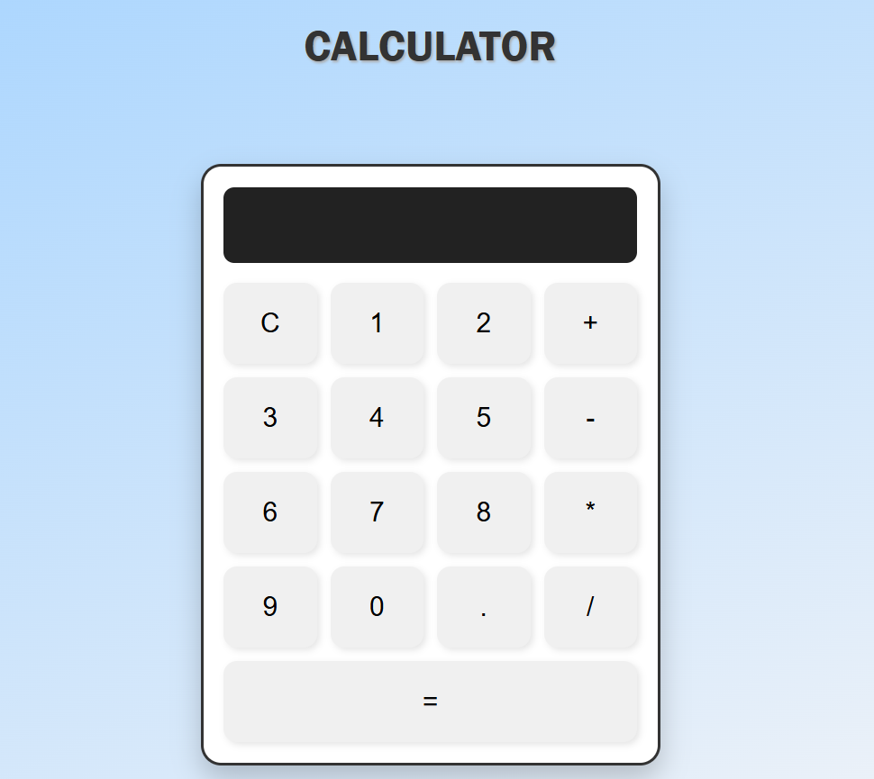
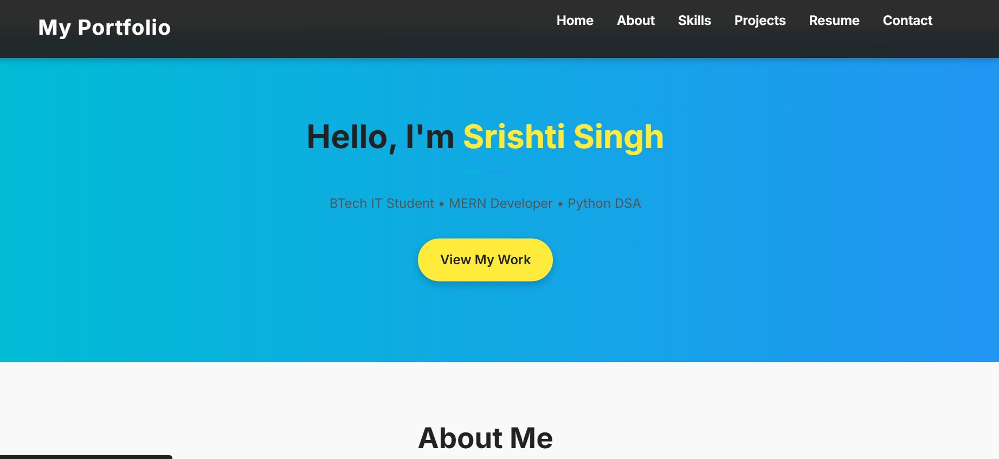

# CodeAlpha Internship – Web Development Projects

I successfully completed my **1-month internship at CodeAlpha** as a Web Development Intern.  
During this internship, I built **3 front-end projects** using **HTML, CSS, and JavaScript**, focusing on clean UI, responsive design, and smooth animations.

---

## Projects

### 1. Calculator
A fully functional calculator with a modern UI, built using HTML, CSS, and JavaScript.  
Features include basic arithmetic operations and a responsive layout.  



---

### 2. Image Gallery
A dynamic image gallery with filtering options and responsive design.  
Users can easily navigate through images with an intuitive interface.  


---

### 3. Portfolio Website
A personal portfolio website showcasing skills, projects, and contact details.  
Includes smooth scrolling, hover effects, and modern animation.  



---

## Tech Stack
- **HTML5**  
- **CSS3** (Flexbox, Animations, Responsive Design)  
- **JavaScript (Vanilla)**  

---

## Internship Details
- **Organization:** CodeAlpha  
- **Role:** Frontend Development Intern  
- **Duration:** 1 Month  
- **Projects Completed:** Calculator, Image Gallery, Portfolio Website  

---

## How to View Projects
1. Clone this repository:
   ```bash
   git clone https://github.com/Srishti024/CodeApha_tasks.git
